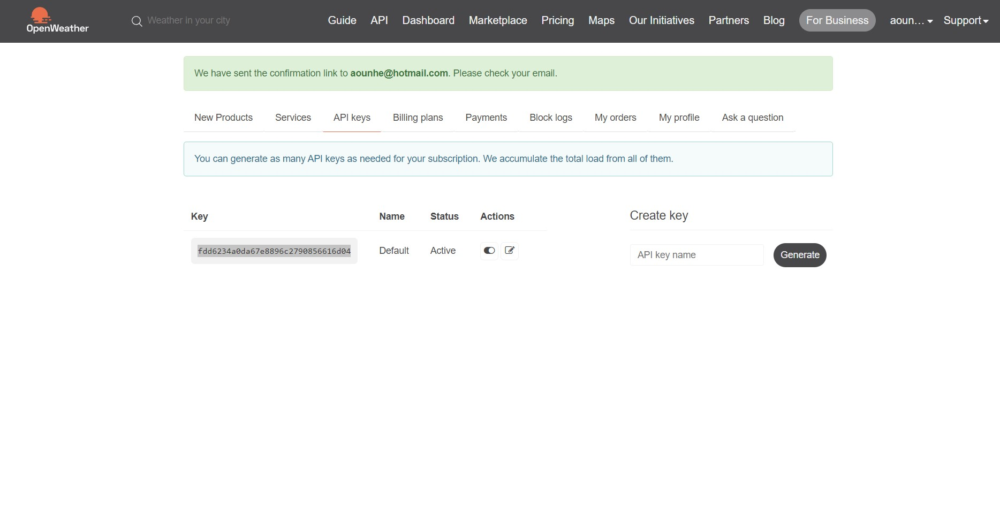
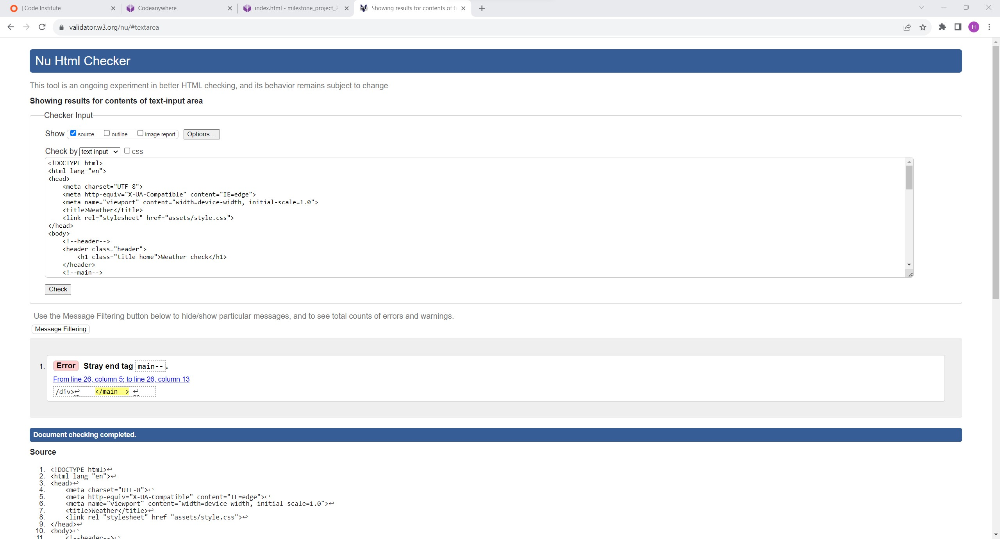
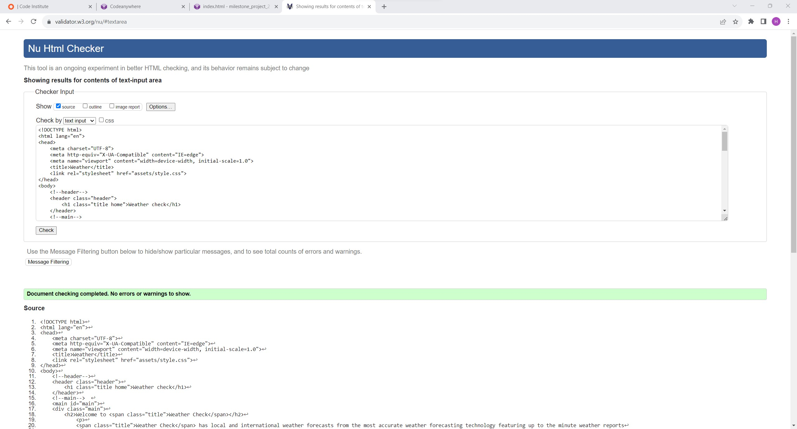
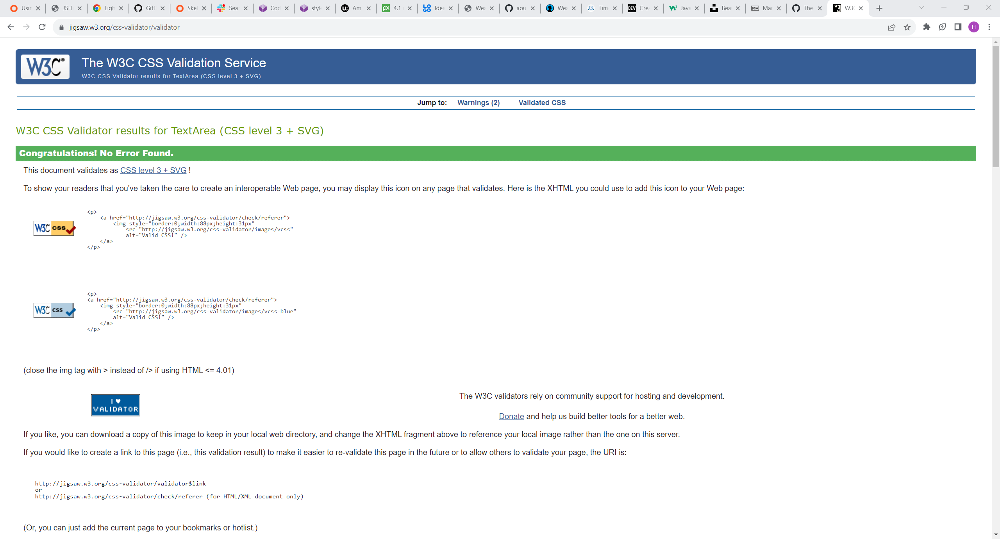
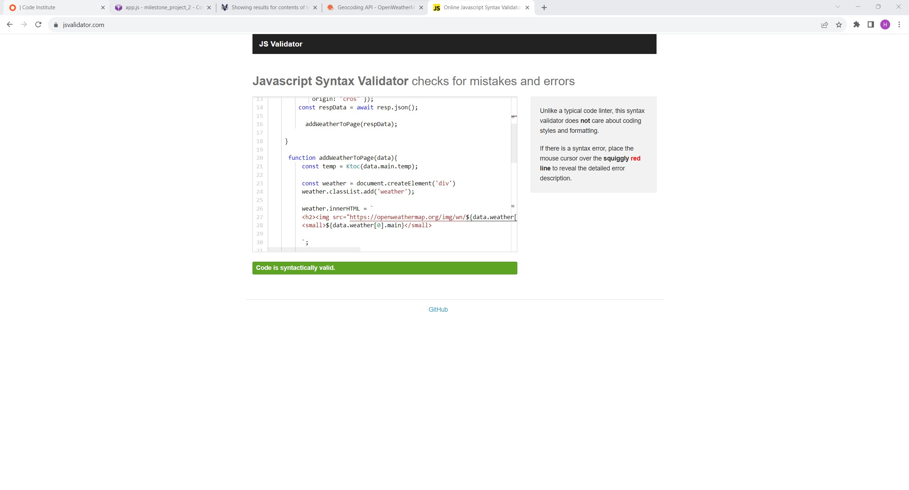

# weather Check

This website aims to announce the current state of weather by fetching data from the _[OpenWeatherMap.org](https://openweathermap.org/)_ API based on user-specified locations.

- - -

  - [User Experience (UX)](#user-experience-ux)
    - [Initial Discussion](#initial-discussion)
      - [Key Information for the site](#key-information-for-the-site)
    - [User Stories](#user-stories)
      - [Client Goals](#client-goals)
  - [Design](#design)
    - [Colour Scheme](#colour-scheme)
    - [Typography](#typography)
    - [Imagery](#imagery)
    - [Wireframes](#wireframes)
    - [Features](#features)
    - [Accessibility](#accessibility)
  - [Technologies Used](#technologies-used)
    - [Languages Used](#languages-used)
    - [API](#frameworks-libraries--programs-used)
    - [API key](#api-key)
    - [Steps to create API Key](#steps-to-create-api-key)
  - [Deployment & Local Development](#deployment--local-development)
    - [Deployment](#deployment)
    - [Local Development](#local-development)
      - [How to Fork](#how-to-fork)
      - [How to Clone](#how-to-clone)
  - [Testing](#testing)
    - [W3C Validator](#w3c-validator)
    - [JSvalidator](#jsvalidator)
    - [Solved Bugs](#solved-bugs)
  - [Credits](#credits)
    - [Code Used](#code-used)
    

## User Experience (UX)

### Initial Discussion

Real time weather conditions for any location in the world.
#### Key Information for the site

- A user friendly platform wich provides real time weather conditions.

### User Stories

#### Client Goals

- To be able to view the site on a range of device sizes.
- To provide a simple weather guide for all user aibilities.

## Design

### Colour Scheme

weather Check uses this small switch palette, pulled from [Colorso](https://coolors.co/)

### Typography

I used Google Fonts for the following font:

- 'Poppins' for all text content across the website. This is a sans serif font.

### Imagery

 [Unsplash](https://unsplash.com/). 

### Wireframes

Wireframes were created for mobile, tablet and desktop.

I wanted to focus more on implementing javascript code.

### Features

- A responsive navigation bar and navigation links across the header from right to left as followed - Home, contact. [Bootstrap v5.3]https://getbootstrap.com/docs/5.3/components/navs-tabs/ so that it is easier to view and navigate on a smaller screen.

- The footer consists of instagram and facebook and youtube

*Home Page:*

- The home page is a simple and elegant design. 
- Underneath the Nav bar i used an image of a landcpe including a writing to welcome user and a little disrption about the website.
- Below this I've added a div containing a search form by location.
- The current weather search form provides up-to-date information about the weather conditions for a specific location. It includes essential details such as temperature, cloud cover, the current weather section often displays weather icons or descriptions to give users a quick visual representation of the weather conditions.

- To learn more about this Data platform, click _[here](https://openweathermap.org/guide)_.

*Contact Page:*
- The contact page is very simple.

- I included a form section for user to leave a feedback or get in touch.

### Accessibility

I have ensure that this website is as accessible friendly as possible, I have done the following to achieve this:

- Used semantic HTML.
- Used visually hidden text to describe background images in CSS, where an alt attribute cannot be supplied.
- Included aria-label for website navigation to describe to the screen reader where the user is being taken to.
- Used alt attributes to images in HTML to describe them.
- Using the [WebAIM](https://webaim.org/resources/contrastchecker/) colour contrast checker to ensure all body text is legible with sufficient contrast.

- - -

## Technologies Used

### Languages Used

HTML, CSS and Javascript were used to create this website.

### Frameworks, Libraries & Programs Used

- Git - For version control.

- Github - To save and store the files for the website.

- unsplash.com - used to download image artwork for website

- IDE: Codeanywhere.com

- API: _[OpenWeatherMap.org](https://openweathermap.org/)_

- [Font Awesome](https://fontawesome.com/) - For the iconography on the website.

- [Google Fonts](https://fonts.google.com/) - To import and use the fonts from the website.

- [Bootstrap](https://getbootstrap.com) - Used for inserting a nav bar in mobile responsive design.

- [Am I Responsive](https://ui.dev/amiresponsive) - To show the website on a range of devices.

- Google Dev Tools - To troubleshoot and test various features, and solve issues with responsiveness and styling.

- [Color Hex](https://www.color-hex.com/color/79804f) to find a lighter colour tint for the header and footer to pass the contrast checker.

#### API

- OpenWeatherMap provides a fast and easy-to-use weather API that allows developers to access current weather data for any location on Earth, including over 200,000 cities. The One Call API 3.0 is recommended as a starting point for using OpenWeather products . It provides access to current weather and forecasts, including minute forecast for 1 hour, hourly forecast for 48 hours, daily forecast for 8 days, and government weather alerts.

##### API Key
- An application programming interface (API) key is a unique identifier used to authenticate and authorize a user, developer, or calling program to an API. However, they are typically used to authenticate and authorize a project with the API rather than a human user.
- The API key often acts as both a unique identifier and a secret token for authentication and authorization, and will generally have a set of access rights on the API associated with it.
 

##### Steps to create API Key
- Step 1: Sign up on OpenWeatherMap with your email and password.
- Step 2: After login, visit the "API keys" tab and click on "Get API key and Start" or "Generate" to create a new key.
- Step 3: Copy the API key and paste it to the relevant field in the plugin or program settings where you'll be making API calls.

## Deployment & Local Development

### Deployment

Github Pages was used to deploy the live website. The instructions are as followed:

1. Log in (sign up) to Github.
2. Search for this repository, Weather Check.
3. Navigate to the settings tab.
4. On the left hand menu click on the pages link.
5. In the source section, select main from the drop down menu under Branch.
6. Select root from the drop down folder and click save.
7. Your live Github pages site is now deployed at the following: [aounhe]()

### Local Development

#### How to Fork

To fork the paddle-adventures repository:

1. Go to the GitHub repository.
2. Click on Fork button in the upper right-hand corner.

#### How to Clone

To clone the Discover-South-Wales repository:

1. Log in (sign up) to Github.
2. Search for this repository, Discover-South-Wales.
3. Select the code button and choose whether you would like to clone with HTTPS, SSH or GitHub CLI and copy the link shown to your clipboard.
4. Open the terminal in your code editor and change the current working directory to the location you want to use for the cloned directory.
5. Type 'git clone' into the terminal and then paste the link you copied. Select enter.

- - -

## Testing

Testing was implemented throughout the entire build of this project. I used Chrome Developer tools to identify and troubleshoot problems along the way.

### W3C Validator

I used W3C HTML Validator on all pages created, and W3C CSS Validator on CSS content.

### JSvalidator

I used JSvalidator on all javascript content.

### Solved Bugs

- I have left the https:// off the beginning of the URL, so it's a relative URL and resolved relative to the document the call is being made from. I just put https:// in front of api.openweathermap.org in the call to fetch

## Credits

### Code Used

- [Bootstrap 5.3](https://getbootstrap.com/) - Code used to implement a nav bar.

- [W3schools HTML DOM Element getElementsByTagName()](https://www.w3schools.com/jsref/met_element_getelementsbytagname.asp) - used to help with js code.

- [openweathermap](https://openweathermap.org/api) - Code used for importing Api.

- [VISUAL CROSSING WEATHER](https://www.visualcrossing.com/resources/documentation/weather-api/timeline-weather-api/) - Used to understand how Api weather work

- [Github](https://github.com/) - Used to get ideas and resolve problems.

- [Weather Application Programming – HoleTex](https://holetex.com/weather-application-programming/): This resource has been instrumental in gaining a comprehensive understanding of weather application programming. It has provided standardized knowledge and guidance on integrating APIs and leveraging the data from OpenWeatherMap for the weather website.